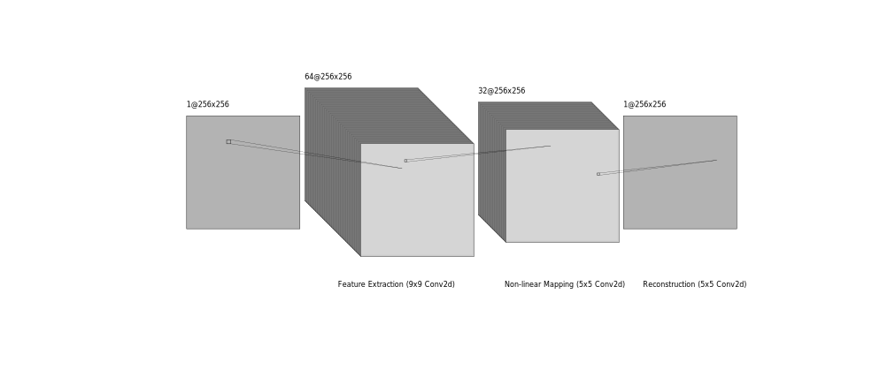
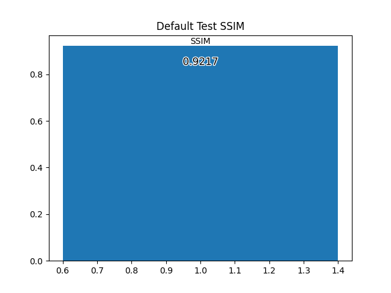
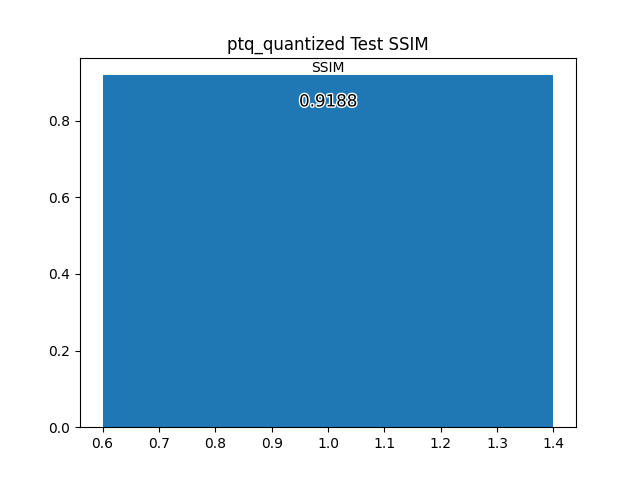
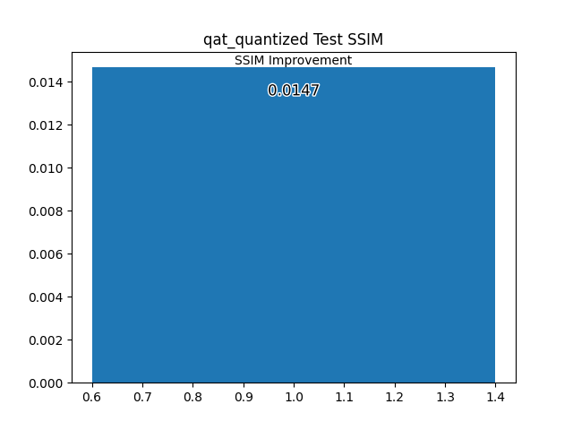
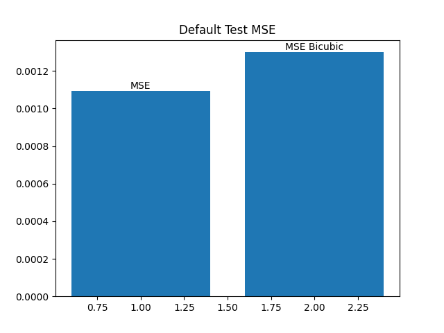
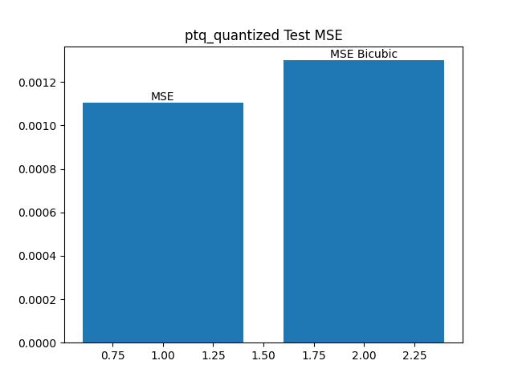
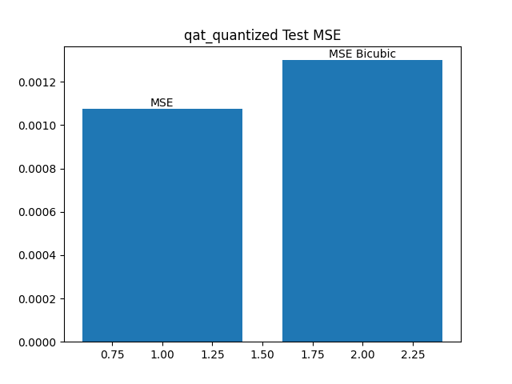

# SRCNNQuantized
This project aims to compare the effects of different quantization methods for SRCNN super resolution model. deployment on MAX78000FTHR board.  The project was created in the scope of "EE634: Digital Image Processing" offered in METU on 2026 Spring.

## Introduction
In this project, SRCNN [1] was used to test the performance degradation caused by quantization errors observed in Post Training Quantization (PTQ) and Quantization Aware Training (QAT). 

## How to Use

After downloading the git repository

With Colab:
1. Upload SECNN_Quantized.ipynb to Colab.
2. Run the code up to and including the drive section. This will create the necessary folders
3. Upload the model weights and dictionaries from git to root directory.  
4. Run the remaining code until quantization section. Definitions subsection of quantization section should also be ran.
5. Use Load Models and Make Inferences section to load the weights and dictionaries inside the immediate directory. 

## Dependencies

This project started while PyTorch was migrating torch.ao to a separate library: torchao. However, because the migration was only halfway done, major CNN quantization capabilities were left in the soon to be deprecated torch.ao which is used in this project. As long as the module versions in dependencies.txt is used, the project should run normally.

## Dataset

DIV2K [2] dataset was used to train SRCNN and tune the QAT process. 800 high resolution (HR) training images were augmented with random vertical and horizontal flips, random image clipping (512x512), and random 90° rotations. Both validation and test sets were augmented during training.

66 validation images were used from the dataset at every epoch to validate the model. SSIM and MSE metrics were used during validation and testing steps.

34 images were used from the dataset at the end of the training to test the performances, 4 of which is displayed in the results section with their respective SSIM values.

Retrospectively, it could be better to not augment the validation data as the augmentation made the metric curves less stable due to changing statistics.

## Model

A Standard SRCNN model was selected to demonstrate the effects of PTQ and QAT. The model has a 64 channel 9x9x1 feature extraction layer, a 32 channel 5x5x64 non-linear mapping layer, and a 5x5x32 reconstruction layer.

The model was trained with the augmented DIV2K dataset for 50 epochs. The training epoch count might not be optimal as it was purposely selected lower to decrease training time. As the project is more focused on the effects of quantization, 50 epochs were thought to be enough.

### Quantization

Quantization is the approximation of high precision, continuous (or pseudo-continuous like floating point numbers) numbers to a set of discrete, low precision values.

In the machine learning context, quantization is invaluable as it can significantly decrease inference times and model sizes with a tradeoff of minimal performance loss.

#### Quantization Formulation

The following equations define affine quantization and dequantization [3]. There also non-linear schemes that could handle non-uniform distributions but these methods are not used in this project.

$$
\begin{align*}
& Quantization\\
x_q &= clip(round(x/S + Z), round(a/S + Z), round(b/S + Z))\\
& Dequantization\\
x &= S * (x_q - Z)\\
& Quantization\ Error\\
e_q &= x - S * (x_q - Z)\\
\end{align*}
$$

where $x \in [a,b]$ and x is a floating point number,

$$
\begin{align*}
x:& Original\ Value\\
x_q :& Quantized\ x\\
e_q :& Quantization\ Error\\
S:& Quantization\ Scale\\
Z:& Zero\ Point\\
\end{align*}
$$

#### Per-tensor or Per-channel Quantization

$Z$ and $S$ values could be specific to each tensor or each channel. Per-channel quantization offers better performance while per-tensor quantization offers better memory efficiency. In this project, per-tensor quantization was used. This is partially due to certain technical problems encountered while using torch.ao with CNNs and per-channel configurations.

#### Observers

The optimal $Z$ and $S$ values are calculated by observers. Several different types of observers are available. Their usage depend on the quantization type (like QAT and PTQ), weight and activation quantization schemes, and device availability. In this project, MinMaxObserver was used for weights while HistogramObserver was used for activations. Use of different observers change how outliers and different input statistics are handled during calibration steps which is relevant for performance. It might also be useful to try and compare different observer types for this reason.

Two different quantization methods were used to compress SRCNN: PTQ and QAT.

#### PTQ

It could be said that PTQ is the fastest and simplest way to quantize a model. However, different configurations exist which makes the PTQ pipeline a little less straightforward than it initially appears.

Two main options are available for PTQ in torch.ao: dynamic and static quantization. The main difference is dynamic quantization handles the quantization scaling online with a tradeoff of slight overhead while static quantization requires calibration inferences while observers are planted in the model.

Dynamic quantization is less effective and not recommended for CNNs. For this reason, static quantization was used in PTQ.

#### QAT

There are several different ways to minimize the quantization error, the one focused on this project is QAT. As its name suggests, QAT requires a second training/calibration phase. The model weights are fake-quantized, which is an operation that quantizes the model activations and weights to simulate quantized forward propagation while still keeping the data stored in floating point variables. The backpropagation step is not modified.

In this project, the QAT calibration training was ran for 8 epochs after 50 epoch training with a decreased learning rate. 

#### Quantization Flow

To simply summarize what is done for each method:

1. The trained model is deep copied into the model to be quantized.
2. The model is changed to evaluation mode with .eval() if PTQ is used. For QAT, training mode is used.
3. Activation and weight observers are configured.
4. Global quantization configuration is generated with the observers.
5. A default QConfigMapping is created and global QConfig is set as its global. In this part, the specific layer types or layers to be quantized can be configure more in depth for custom mixed quantization schemes.
6. The model is prepared for fx_graph conversion which basically merges all the layers for faster execution and easier quantization flow.
7. Before calibration or training of the quantized model, the fx prepared model could be moved to desired device type.
8. If PTQ, calibration for observers is done at this step. If QAT, training starts.
9. After training and calibration is over, fx prepared model is converted to fx_graph and the model is quantized.

## Workflow

## Results

Among the two quantization types, QAT performed considerably better even with a smaller model like SRCNN.

### SSIM Comparison

Over the 34 test images,he average SSIM improvement of the unquantized model was 0.0156. 

QAT showed an improvement of 0.0147 which is ~94% performance retention after quantization.

 PTQ on the other hand showed 0.0127 SSIM improvement which is significantly less than QAT with ~81% performance retention.

#### Original

#### PTQ

#### QAT

### MSE Comparison

#### Original

#### PTQ

#### QAT

### Test Images

Test images, SSIMs and inference time for model outputs are given in top left corners of each image. 
Top: Input image (scaled with bicubic interpolation), Center: Output image, Bottom: True image

Inference times are a little inconsistent with what is expected which might be an issue with loading and using the model for inference instead of edge deployment.

#### Original

#### PTQ

#### QAT

## Future Work / Shortcomings

One of the main intended goals of the project was to deploy the quantized models to MAX78000FTHR as well as trying out the ai8x training and synthesis frameworks. However, these could not be implemented in time, and therefore, are listed as future work.

## Directories

maxim: Not added as it does not contain extra work other than what is provided in MaximSDK.

img: Markdown images.

img/results: Result images and plots

torch: PyTorch related codes. All the code is written as jupyter notebooks for ease of debugging however they might be converted to regular .py files if deemed necessary.

## References

[1] C. Dong, C. C. Loy, K. He, ve X. Tang, “Image Super-Resolution Using Deep Convolutional Networks”, 31 Temmuz 2015, arXiv: arXiv:1501.00092. doi: 10.48550/arXiv.1501.00092.

[2] https://www.kaggle.com/datasets/soumikrakshit/div2k-high-resolution-images

[3] https://huggingface.co/docs/optimum/concept_guides/quantization